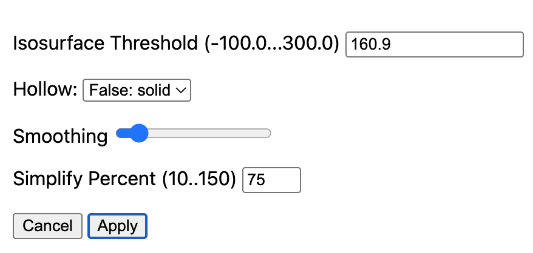

### ct2print voxels to mesh

A basic example of converting a voxel-based image to a simplified mesh. This interactive drag-and-drop web page allows you to create meshes that can be used with a 3D printer.

**No data is sent to a server. Everything happens in *your* browser window, on *your* machine.**


### Usage

1. Open the [live demo](https://niivue.github.io/ct2print/).
2. **Option 1** The web page automatically loads with a default T1 MRI scan. If you want to use this scan, go to step 5.
3. **Option 2** If your T1 MRI scan is in NIfTI format, drag and drop the file onto the web page.
4. **Option 3** If your image is in DICOM format, it may load if you drag and drop the files. If this fails, convert your images with [dcm2niix](https://niivue.github.io/niivue-dcm2niix/) and save the result as a NIfTI format file that brain2print can open.
5. Note when you click on the image, the voxel intensity is shown in the status bar at the bottom-left of the web page. You can decide a nice intensity threshold to segment your image (e.g. for a CT scan, bone will be brighter than soft tissue).
6. Press the `Create Mesh` button and select your preferred settings: 

  - The [Isosurface Threshold](https://en.wikipedia.org/wiki/Marching_cubes) is the voxel intensity used to discriminate the mesh surface. See the previous step for detials. By default, this value is set to the [Otsu threshold](https://en.wikipedia.org/wiki/Otsu%27s_method).
  - You can choose `Smoothing` to make the surfaces less jagged at the expense of computation time.
  - You can choose to `Simplify` to reduce the number of triangles and create smaller files.
7. Once you have set your preferences, press `Apply`.
8. You will see the mesh appear and can interactively view it. If you are unhappy with the result, repeat step 6 with different settings. If you want to print the results, press the `Save Mesh` button.


### For Developers

You can serve a hot-reloadable web page that allows you to interactively modify the source code.

```bash
git clone https://github.com/niivue/ct2print
cd ct2print
npm install
npm run dev
```

## References

This web page combines three packages developed by our team:

 - [niivue](https://github.com/niivue/niivue) reading images and visualization
 - [ITK-Wasm](https://github.com/InsightSoftwareConsortium/ITK-Wasm) for voxel-to-mesh and mesh processing
